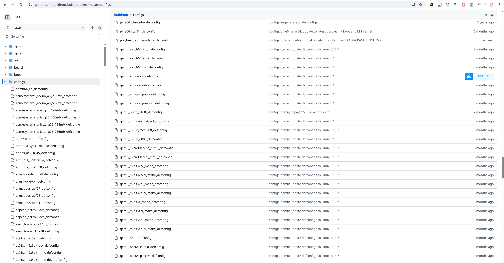
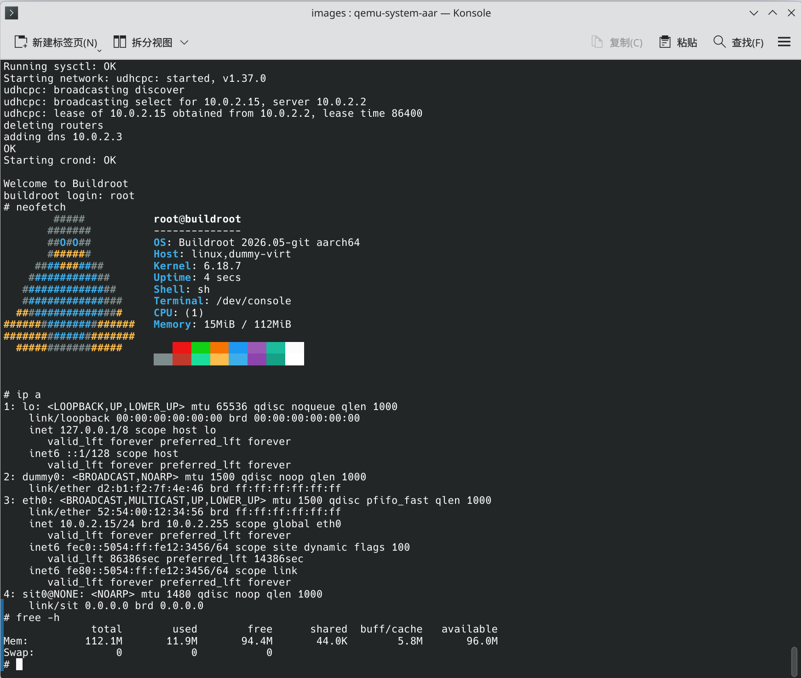

Virt板是QEMU官方提供的一个专门模拟ARM/RISC-V指令集的通用设备，Buildroot里维护了很多QEMU Virt的配置，可以直接编译并启动：

[https://github.com/buildroot/buildroot/tree/master/configs](https://github.com/buildroot/buildroot/tree/master/configs)



走一遍流程，用QEMU启动qemu_aarch64_virt_defconfig


## 一、获取源码并编译
```bash
git clone https://github.com/buildroot/buildroot.git

cd buildroot

# 生成对应的.config文件
make qemu_aarch64_virt_defconfig

# 编译生成kernel和rootfs
make -j$(nproc)
```

使用buildroot的默认配置，它会自动下载或构建交叉编译工具链，下载linux kernel源码并编译

编译后的结果在output/images中

```bash
❯ ls
Image  rootfs.ext2  rootfs.ext4  start-qemu.sh
```

## 二、用QEMU启动Linux系统
buildroot在编译后会提供一个直接启动QEMU的脚本，其中具体操作QEMU的部分是：

```bash
qemu-system-aarch64 \
  -M virt \
  -cpu cortex-a53 \
  -nographic \
  -smp 1 \
  -kernel Image \
  -append "rootwait root=/dev/vda console=ttyAMA0" \
  -netdev user,id=eth0 \
  -device virtio-net-device,netdev=eth0 \
  -drive file=rootfs.ext4,if=none,format=raw,id=hd0 \
  -device virtio-blk-device,drive=hd0
```

模拟cortex-a53的QEMU官方提供的ARM通用虚拟开发板，单核CPU, 无图形化界面，kernel的Image就在脚本所在目录。

其中值得注意的是：

+ 传递内核参数

    ```bash
    -append "rootwait root=/dev/vda console=ttyAMA0"
    ```

+ 创建网络与添加虚拟网卡
+ 利用了宿主机的虚拟磁盘来承载rootfs.ext4，然后挂载这个虚拟磁盘/dev/vda来作为rootfs，rootwait表示等待虚拟磁盘出现后再启动

    ```bash
    rootfs.ext4 (宿主机文件)
    ↓
    QEMU 当成虚拟硬盘
    ↓
    虚拟硬盘通过 VirtIO 暴露给 guest Linux
    ↓
    Linux 识别成 /dev/vda
    ↓
    内核根据 root=/dev/vda 挂载为 /
    ```

## 三、启动过程
```bash
❯ ./start-qemu.sh
Booting Linux on physical CPU 0x0000000000 [0x410fd034]
Linux version 6.18.7 (hao@archlinux) (aarch64-buildroot-linux-gnu-gcc.br_real (Buildroot 2026.02-701-ga9942e8793) 14.3.0, GNU ld (GNU Binutils) 2.45.1) #1 SMP Thu Apr 30 16:33:49 CST 2026
random: crng init done
Machine model: linux,dummy-virt
efi: UEFI not found.
OF: reserved mem: Reserved memory: No reserved-memory node in the DT
Zone ranges:
  DMA      [mem 0x0000000040000000-0x0000000047ffffff]
  DMA32    empty
  Normal   empty
Movable zone start for each node
Early memory node ranges
  node   0: [mem 0x0000000040000000-0x0000000047ffffff]
Initmem setup node 0 [mem 0x0000000040000000-0x0000000047ffffff]
psci: probing for conduit method from DT.
psci: PSCIv1.1 detected in firmware.
psci: Using standard PSCI v0.2 function IDs
psci: Trusted OS migration not required
psci: SMC Calling Convention v1.0
percpu: Embedded 20 pages/cpu s43864 r8192 d29864 u81920
Detected VIPT I-cache on CPU0
CPU features: detected: ARM erratum 845719
alternatives: applying boot alternatives
Kernel command line: rootwait root=/dev/vda console=ttyAMA0
printk: log buffer data + meta data: 131072 + 458752 = 589824 bytes
Dentry cache hash table entries: 16384 (order: 5, 131072 bytes, linear)
Inode-cache hash table entries: 8192 (order: 4, 65536 bytes, linear)
software IO TLB: SWIOTLB bounce buffer size adjusted to 0MB
software IO TLB: area num 1.
software IO TLB: mapped [mem 0x0000000047f1e000-0x0000000047f5e000] (0MB)
Built 1 zonelists, mobility grouping on.  Total pages: 32768
mem auto-init: stack:all(zero), heap alloc:off, heap free:off
SLUB: HWalign=64, Order=0-3, MinObjects=0, CPUs=1, Nodes=1
rcu: Hierarchical RCU implementation.
rcu:    RCU restricting CPUs from NR_CPUS=512 to nr_cpu_ids=1.
rcu: RCU calculated value of scheduler-enlistment delay is 25 jiffies.
rcu: Adjusting geometry for rcu_fanout_leaf=16, nr_cpu_ids=1
NR_IRQS: 64, nr_irqs: 64, preallocated irqs: 0
Root IRQ handler: gic_handle_irq
GICv2m: range[mem 0x08020000-0x08020fff], SPI[80:143]
rcu: srcu_init: Setting srcu_struct sizes based on contention.
arch_timer: cp15 timer running at 62.50MHz (virt).
clocksource: arch_sys_counter: mask: 0x1ffffffffffffff max_cycles: 0x1cd42e208c, max_idle_ns: 881590405314 ns
sched_clock: 57 bits at 63MHz, resolution 16ns, wraps every 4398046511096ns
Console: colour dummy device 80x25
Calibrating delay loop (skipped), value calculated using timer frequency.. 125.00 BogoMIPS (lpj=250000)
pid_max: default: 32768 minimum: 301
Mount-cache hash table entries: 512 (order: 0, 4096 bytes, linear)
Mountpoint-cache hash table entries: 512 (order: 0, 4096 bytes, linear)
cacheinfo: Unable to detect cache hierarchy for CPU 0
rcu: Hierarchical SRCU implementation.
rcu:    Max phase no-delay instances is 1000.
EFI services will not be available.
smp: Bringing up secondary CPUs ...
smp: Brought up 1 node, 1 CPU
SMP: Total of 1 processors activated.
CPU: All CPU(s) started at EL1
CPU features: detected: 32-bit EL0 Support
CPU features: detected: CRC32 instructions
CPU features: detected: PMUv3
alternatives: applying system-wide alternatives
Memory: 112176K/131072K available (8640K kernel code, 894K rwdata, 2100K rodata, 1152K init, 510K bss, 17476K reserved, 0K cma-reserved)
devtmpfs: initialized
clocksource: jiffies: mask: 0xffffffff max_cycles: 0xffffffff, max_idle_ns: 7645041785100000 ns
posixtimers hash table entries: 512 (order: 1, 8192 bytes, linear)
futex hash table entries: 256 (16384 bytes on 1 NUMA nodes, total 16 KiB, linear).
29392 pages in range for non-PLT usage
520912 pages in range for PLT usage
DMI not present or invalid.
NET: Registered PF_NETLINK/PF_ROUTE protocol family
DMA: preallocated 128 KiB GFP_KERNEL pool for atomic allocations
DMA: preallocated 128 KiB GFP_KERNEL|GFP_DMA pool for atomic allocations
DMA: preallocated 128 KiB GFP_KERNEL|GFP_DMA32 pool for atomic allocations
thermal_sys: Registered thermal governor 'step_wise'
cpuidle: using governor menu
hw-breakpoint: found 6 breakpoint and 4 watchpoint registers.
ASID allocator initialised with 65536 entries
Serial: AMBA PL011 UART driver
9000000.pl011: ttyAMA0 at MMIO 0x9000000 (irq = 13, base_baud = 0) is a PL011 rev1
printk: console [ttyAMA0] enabled
ACPI: Interpreter disabled.
iommu: Default domain type: Translated
iommu: DMA domain TLB invalidation policy: strict mode
SCSI subsystem initialized
pps_core: LinuxPPS API ver. 1 registered
pps_core: Software ver. 5.3.6 - Copyright 2005-2007 Rodolfo Giometti <giometti@linux.it>
PTP clock support registered
vgaarb: loaded
clocksource: Switched to clocksource arch_sys_counter
pnp: PnP ACPI: disabled
NET: Registered PF_INET protocol family
IP idents hash table entries: 2048 (order: 2, 16384 bytes, linear)
tcp_listen_portaddr_hash hash table entries: 256 (order: 0, 4096 bytes, linear)
Table-perturb hash table entries: 65536 (order: 6, 262144 bytes, linear)
TCP established hash table entries: 1024 (order: 1, 8192 bytes, linear)
TCP bind hash table entries: 1024 (order: 3, 32768 bytes, linear)
TCP: Hash tables configured (established 1024 bind 1024)
UDP hash table entries: 256 (order: 2, 16384 bytes, linear)
UDP-Lite hash table entries: 256 (order: 2, 16384 bytes, linear)
NET: Registered PF_UNIX/PF_LOCAL protocol family
PCI: CLS 0 bytes, default 64
workingset: timestamp_bits=46 max_order=15 bucket_order=0
fuse: init (API version 7.45)
Block layer SCSI generic (bsg) driver version 0.4 loaded (major 249)
io scheduler mq-deadline registered
io scheduler kyber registered
pci-host-generic 4010000000.pcie: host bridge /pcie@10000000 ranges:
pci-host-generic 4010000000.pcie:       IO 0x003eff0000..0x003effffff -> 0x0000000000
pci-host-generic 4010000000.pcie:      MEM 0x0010000000..0x003efeffff -> 0x0010000000
pci-host-generic 4010000000.pcie:      MEM 0x8000000000..0xffffffffff -> 0x8000000000
pci-host-generic 4010000000.pcie: Memory resource size exceeds max for 32 bits
pci-host-generic 4010000000.pcie: ECAM at [mem 0x4010000000-0x401fffffff] for [bus 00-ff]
pci-host-generic 4010000000.pcie: PCI host bridge to bus 0000:00
pci_bus 0000:00: root bus resource [bus 00-ff]
pci_bus 0000:00: root bus resource [io  0x0000-0xffff]
pci_bus 0000:00: root bus resource [mem 0x10000000-0x3efeffff]
pci_bus 0000:00: root bus resource [mem 0x8000000000-0xffffffffff]
pci 0000:00:00.0: [1b36:0008] type 00 class 0x060000 conventional PCI endpoint
pci_bus 0000:00: resource 4 [io  0x0000-0xffff]
pci_bus 0000:00: resource 5 [mem 0x10000000-0x3efeffff]
pci_bus 0000:00: resource 6 [mem 0x8000000000-0xffffffffff]
virtio_blk virtio0: 1/0/0 default/read/poll queues
virtio_blk virtio0: [vda] 122880 512-byte logical blocks (62.9 MB/60.0 MiB)
rtc-pl031 9010000.pl031: registered as rtc0
rtc-pl031 9010000.pl031: setting system clock to 2026-04-30T08:36:05 UTC (1777538165)
hw perfevents: enabled with armv8_pmuv3 PMU driver, 7 (0,8000003f) counters available
NET: Registered PF_INET6 protocol family
Segment Routing with IPv6
In-situ OAM (IOAM) with IPv6
sit: IPv6, IPv4 and MPLS over IPv4 tunneling driver
NET: Registered PF_PACKET protocol family
NET: Registered PF_KEY protocol family
NET: Registered PF_VSOCK protocol family
registered taskstats version 1
clk: Disabling unused clocks
PM: genpd: Disabling unused power domains
check access for rdinit=/init failed: -2, ignoring
EXT4-fs (vda): orphan cleanup on readonly fs
EXT4-fs (vda): mounted filesystem c394bba6-5965-4a70-a0a4-17e04562b2fb ro with ordered data mode. Quota mode: disabled.
VFS: Mounted root (ext4 filesystem) readonly on device 254:0.
devtmpfs: mounted
Freeing unused kernel memory: 1152K
Run /sbin/init as init process
EXT4-fs (vda): re-mounted c394bba6-5965-4a70-a0a4-17e04562b2fb r/w.
Saving 256 bits of creditable seed for next boot
Starting syslogd: OK
Starting klogd: OK
Running sysctl: OK
Starting network: udhcpc: started, v1.37.0
udhcpc: broadcasting discover
udhcpc: broadcasting select for 10.0.2.15, server 10.0.2.2
udhcpc: lease of 10.0.2.15 obtained from 10.0.2.2, lease time 86400
deleting routers
adding dns 10.0.2.3
OK
Starting crond: OK

Welcome to Buildroot
buildroot login: root
# ls
# pwd
/root
# ls /
bin           lib           media         root          tmp
crond.reboot  lib64         mnt           run           usr
dev           linuxrc       opt           sbin          var
etc           lost+found    proc          sys

```


退出QEMU：先按ctrl + a,再按x
