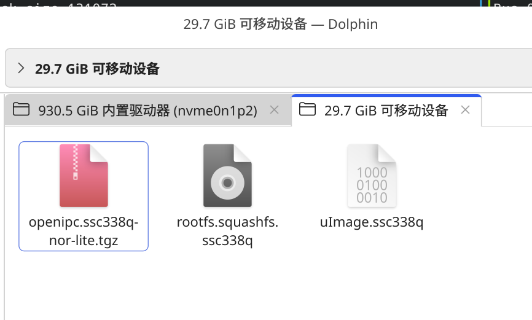

编译环境需要Ubuntu20.04、Ubuntu22.04或者Debian12，如果不是对应系统的话，可以用docker，参考这个项目：

::gitHub{repo="haoyn231/rk35xx_build_env"}

### 1. 获取官方SDK
```bash
https://github.com/OpenIPC/firmware
```
### 2. 编译SSC338Q的openipc固件
```bash
# 安装依赖
make deps

# 生成配置文件
make BOARD=ssc338q_lite defconfig

# 编译buildroot linux
make BOARD=ssc338q_lite br-linux

# 全编译，生成固件
make BOARD=ssc338q_lite all
```
最终生成的固件在 output/images
```bash
builder@archlinux:/workspace/firmware$ ls output/images/
openipc.ssc338q-nor-lite.tgz  rootfs.cpio  rootfs.squashfs.ssc338q  rootfs.ssc338q.tar  uImage.ssc338q
```
### 3. 烧录固件
对于openipc设备，如果设备能正常启动，那么烧录固件最方便的方式是把固件传输到设备文件系统里，然后用系统自带的工具进行升级。
当前设备虽然有以太网卡，但是只有接口，需要外接。所以这里采取用SD卡来传输固件到设备上。
查看flash分区表：
```bash
root@openipc-ssc338q:~# cat /proc/mtd
dev:    size   erasesize  name
mtd0: 00040000 00010000 "boot"
mtd1: 00010000 00010000 "env"
mtd2: 00200000 00010000 "kernel"
mtd3: 00800000 00010000 "rootfs"
mtd4: 005b0000 00010000 "rootfs_data"
```
需要准备一个FAT格式的SD卡

#### 备份旧镜像
备份到SD卡中
```bash
# 先创建一个文件夹
mkdir -p /mnt/mmcblk0p1/bak/
dd if=/dev/mtd0 of=/mnt/mmcblk0p1/bak/mtd0_boot.bin
dd if=/dev/mtd1 of=/mnt/mmcblk0p1/bak/mtd1_env.bin
dd if=/dev/mtd2 of=/mnt/mmcblk0p1/bak/mtd2_kernel.bin
dd if=/dev/mtd3 of=/mnt/mmcblk0p1/bak/mtd3_rootfs.bin
dd if=/dev/mtd4 of=/mnt/mmcblk0p1/bak/mtd4_rootfs_data.bin
```
#### 使用系统自带的 sysupgrade 来烧录固件
```bash
cp /mnt/mmcblk0p1/images/openipc.ssc338q-nor-lite.tgz /tmp/
sync

sysupgrade \
  --archive=/tmp/openipc.ssc338q-nor-lite.tgz
  
# 全量更新，包括kernel和rootfs  
sysupgrade --force_ver --wipe_overlay --archive=/tmp/openipc.ssc338q-nor-lite.tgz
```