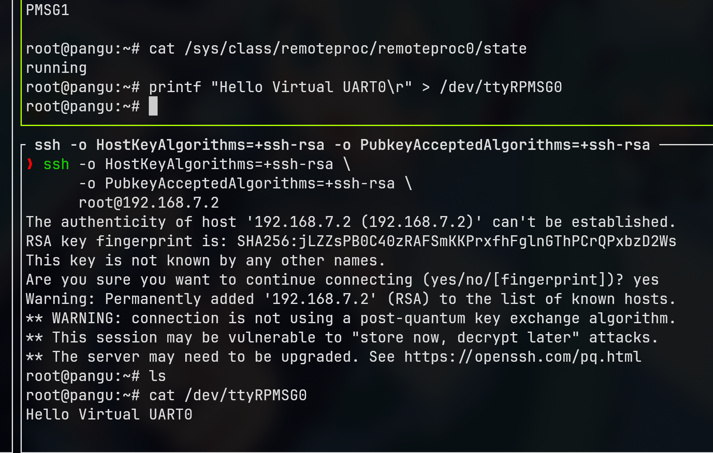

## 一、OpenAMP 串口回传例程

PanGUBoard的官方资料提供了一个STM32CubeMX的IOC文件，但是由于STM32CubeMX在我用的Niri上显示异常，我就不折腾了，直接使用官方提供的默认例程。

测试OpenAMP TTY echo这个例程。在M4端运行了一个叫做OpenAMP的库，通过串口和A核Linux进行通信：

M4启动后会初始化HAL、IPCC、mailbox和OpenAMP，创建两个Virtual UART虚拟串口，并注册回调。

在主循环里不断Poll mailbox/RPMsg消息，如果某个通道接受到消息，就进行回传。

```c
while (1)
  {
    OPENAMP_check_for_message();
    /* USER CODE END WHILE */
    if (VirtUart0RxMsg) {
      VirtUart0RxMsg = RESET;
      VIRT_UART_Transmit(&huart0, VirtUart0ChannelBuffRx, VirtUart0ChannelRxSize);
    }
    if (VirtUart1RxMsg) {
      VirtUart1RxMsg = RESET;
      VIRT_UART_Transmit(&huart1, VirtUart1ChannelBuffRx, VirtUart1ChannelRxSize);
    }
    /* USER CODE BEGIN 3 */
  }
```

在A核Linux系统发送信息给它，它接受到后再回传给A核Linux系统。

以上例程用作基于OpenAMP的AMP通信验证：

remoteproc到virtio到rpmsg到ttyRPMSG，从而到M4核里的callback函数回传信息。

## 二、例程加载与调试

例程是使用STM32CubeIDE，我直接让Codex把它整理为一个自包含的CMake程序，最终编译为一个elf文件，复制到板端

通过Linux Remoteproc来加载固件并启动M4

```bash
root@pangu:~# echo OpenAMP_TTY_echo.elf > /sys/class/remoteproc/remoteproc0/firmware

root@pangu:~# echo start > /sys/class/remoteproc/remoteproc0/state
[   53.027015] remoteproc remoteproc0: powering up m4
[   53.081472] remoteproc remoteproc0: Booting fw image OpenAMP_TTY_echo.elf, size 1948628
[   53.088656]  m4@0#vdev0buffer: assigned reserved memory node vdev0buffer@10044000
[   53.101665] virtio_rpmsg_bus virtio0: rpmsg host is online
[   53.101837] virtio_rpmsg_bus virtio0: creating channel rpmsg-tty-channel addr 0x0
[   53.114080] rpmsg_tty virtio0.rpmsg-tty-channel.-1.0: new channel: 0x400 -> 0x0 : ttyRPMSG0
[   53.115519]  m4@0#vdev0buffer: registered virtio0 (type 7)
[   53.125598] virtio_rpmsg_bus virtio0: creating channel rpmsg-tty-channel addr 0x1
[   53.137112] rpmsg_tty virtio0.rpmsg-tty-channel.-1.1: new channel: 0x401 -> 0x1 : ttyRPMSG1
[   53.166627] remoteproc remoteproc0: remote processor m4 is now up
root@pangu:~#
```

会出现两个RPMsg设备

```bash
root@pangu:~# ls /dev/ttyR*
/dev/ttyRPMSG0  /dev/ttyRPMSG1
```

查看M4状态：

```bash
root@pangu:~# cat /sys/class/remoteproc/remoteproc0/state
running
root@pangu:~# cat /sys/class/remoteproc/remoteproc0/firmware
OpenAMP_TTY_echo.elf
root@pangu:~#
```

查看M4 trace

```bash
root@pangu:~# mount -t debugfs debugfs /sys/kernel/debug 2>/dev/null || true
root@pangu:~# cat /sys/kernel/debug/remoteproc/remoteproc0/trace0
[00000.000][INFO ]Cortex-M4 boot successful with STM32Cube FW version: v1.0.0
[00000.013][INFO ]Virtual UART0 OpenAMP-rpmsg channel creation
[00000.013][INFO ]Virtual UART1 OpenAMP-rpmsg channel creation
root@pangu:~#
```

通过RPMsg给M4发信息

在一个终端里发信息，另一个终端监听虚拟串口，就会看到回传发送的信息



停止M4：

```bash
root@pangu:~# echo stop > /sys/class/remoteproc/remoteproc0/state
[  222.158087] rpmsg_tty virtio0.rpmsg-tty-channel.-1.0: rpmsg tty device 0 is removed
[  222.165509] rpmsg_tty virtio0.rpmsg-tty-channel.-1.1: rpmsg tty device 1 is removed
[  222.696591] remoteproc remoteproc0: warning: remote FW shutdown without ack
[  222.702125] remoteproc remoteproc0: stopped remote processor m4

oot@pangu:~# cat /sys/class/remoteproc/remoteproc0/state
offline
```
