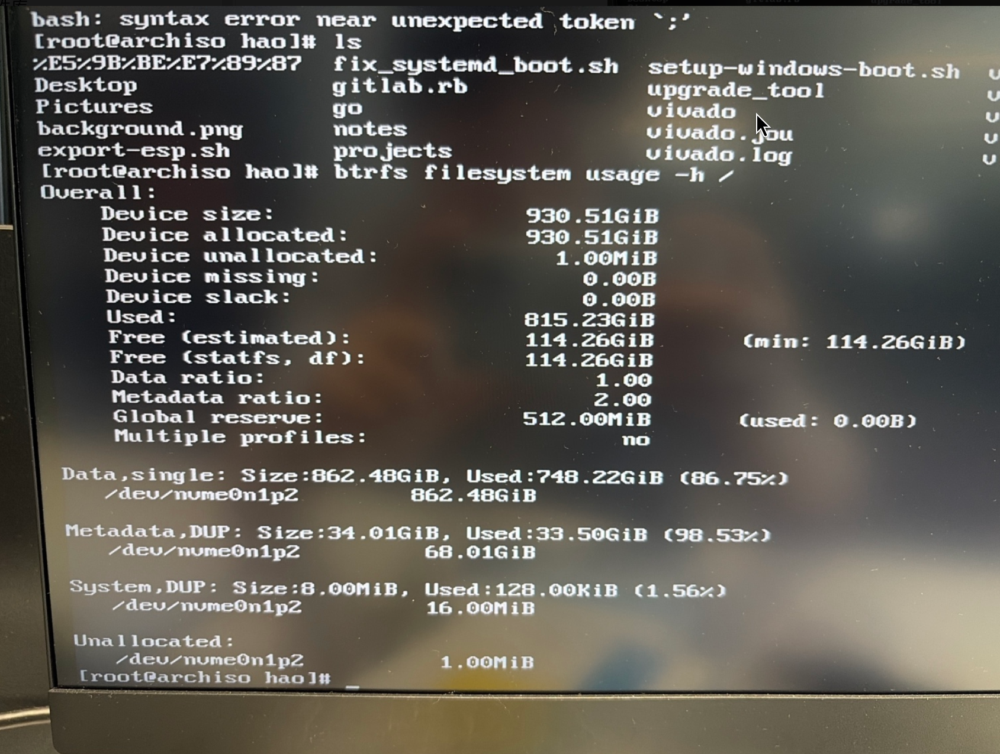
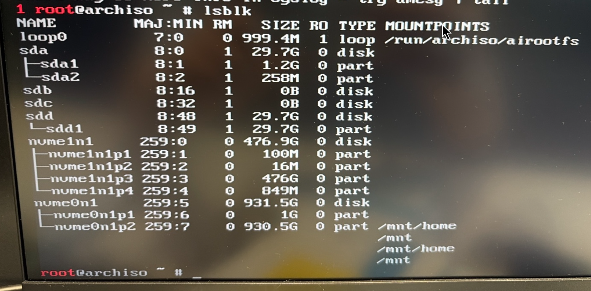
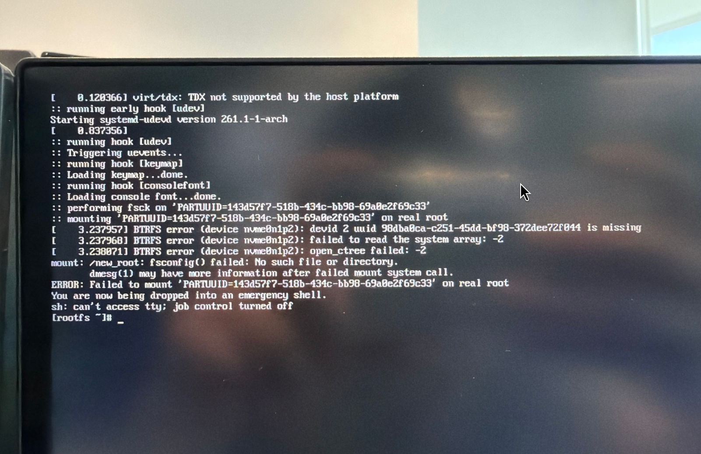

## 背景

继上一次被未清理的Btrfs Snapshots文件给我的磁盘撑爆后，过了两天（在2026年7月17日），又出现了同样的磁盘被撑爆的情况。其实上一次我就有疑惑，虽然Snapshots文件攒了很多，但是`fastfetch`中输出的磁盘占用情况只有大概 870GiB/930GiB，还不到真正爆满的程度。

在通过USB Live镜像`arch-chroot`进原系统后，查看btrfs文件系统占用情况：

```bash
btrfs filesystem usage -h /
```



可以看到其中`allocated`已经满了，`unallocated`只剩1MiB了，其中：

```bash
Metadata,DUP: Size:34.01GiB, Used:22.50GiB(98.53%)
```

虽然`df -h`和`fastfetch`输出里还剩几十GB，但是Btrfs文件系统以及分配满了，这才是核心问题。

## 系统修复

忽略漫长的尝试，直接记录最终的修复流程：

**注意这里我没有用`arch-chroot`，是在Live USB系统的基础上直接操作原系统分区的。**

在已有Live USB的基础上，再找一个U盘或者SD卡，插到电脑上（我这里用的是SD卡）。



把它临时加入Btrfs文件系统

把它格式化为Btrfs格式

```bash
mkfs.btrfs -f /dev/sdd1
```

在根分区（`/dev/nvme0n1p2`挂载到了`/mnt`）的基础上，把它加入已有Btrfs

```bash
btrfs device add /dev/sdd1 /mnt
```

检查

```bash
btrfs filesystem show /mnt
```

可以看到已经加入

```bash
Label: none
 Total devices 2 FS bytes used xxx

 devid 1 /dev/nvme0n1p2
 devid 2 /dev/sdd1
```

现在可以进行`metadata balance`

```bash
btrfs balance start -musage=50 /mnt
```

实际上我没有执行完，时间太久了，就`ctrl + C`中断了，但是还是成功释放了空间。可以保守一些，慢慢释放。

再通过`btrfs filesystem usage -T /mnt`查看Btrfs系统占用，可以看到metadata占用明显小了。此时就可以进入原系统了。

但是要注意的是，不要立马把SD卡拔掉，因为它已经被计入Btrfs文件系统了。我这里就踩了这个坑，在原系统可以正常进入后，我以为修复完毕了，就心满意足得把SD卡拔掉了，结果系统立马又出现了之前的状况，重启之后也无法进入系统：



核心问题是 **Btrfs 根文件系统挂载失败**，如果再把之前的SD卡插回去，又能成功进入系统。

在之前的基础上，需要从Btrfs中移除SD卡

```bash
sudo btrfs device remove /dev/sdd1 /
```

（我这里是在重启后的原系统中执行的，如果还在Live USB中，应该需要注意通过挂载分区或者`arch-chroot`）


## 事后复盘

我后续让codex分析系统，是因为我把`~/projects`也加入了btrfs快照，但是我这个路径下有很多sdk,我会进行很多sdk编译和开发，然后就导致btrfs的metadata占用过高。

而对于Btrfs snapshot来说，它不复制数据，但是只对于静态数据有效，而我的编译目录里的文件是**高频变化、大量小文件、编译产物**，是万万不能放进Btrfs snapshot的。

对于这些文件，Btrfs需要维护

- extent reference
- checksum tree
- backref
- inode metadata
- delayed refs

如果一次编译会产生几十万个变化，metadata会疯狂增长，最终导致爆满。而且，在我让codex把编译目录移出快照范围并且清理后，我实际的磁盘占用只有大概 320GiB/930GiB，可见之前800多GiB都是无效数据。
