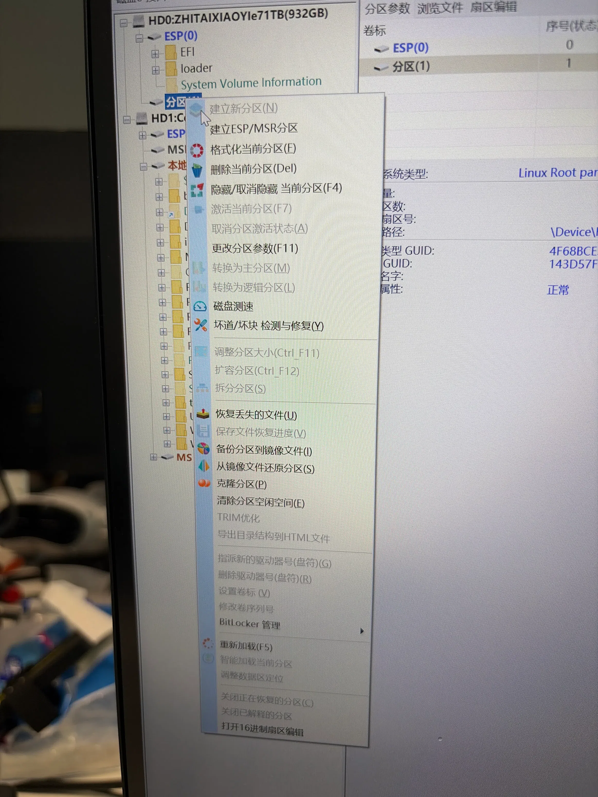
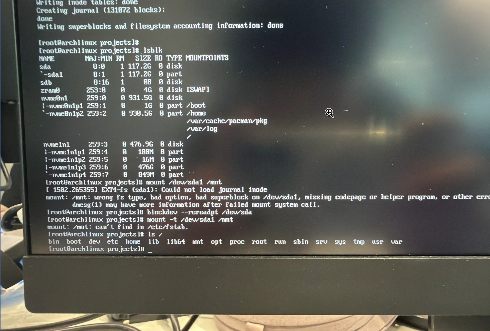
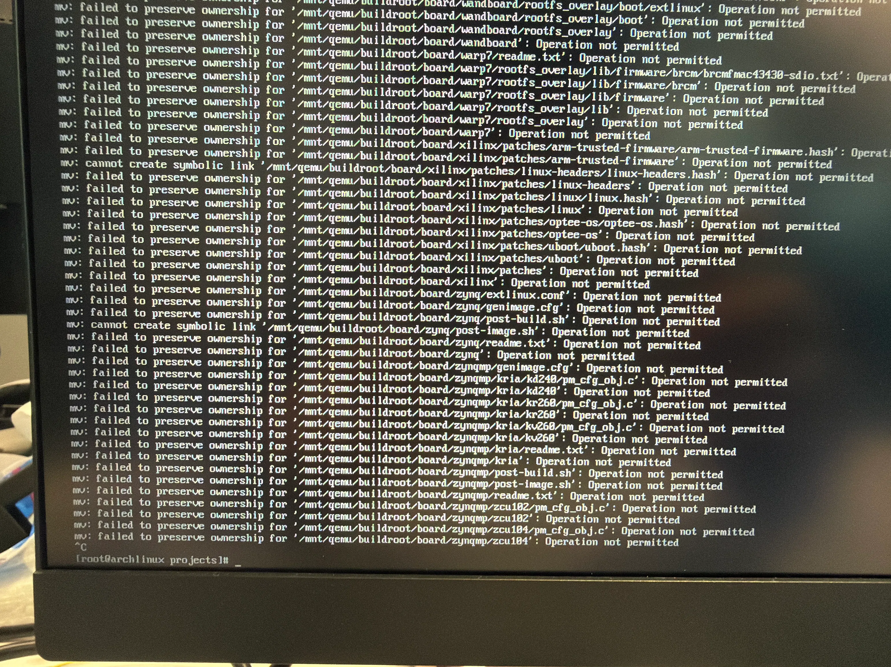
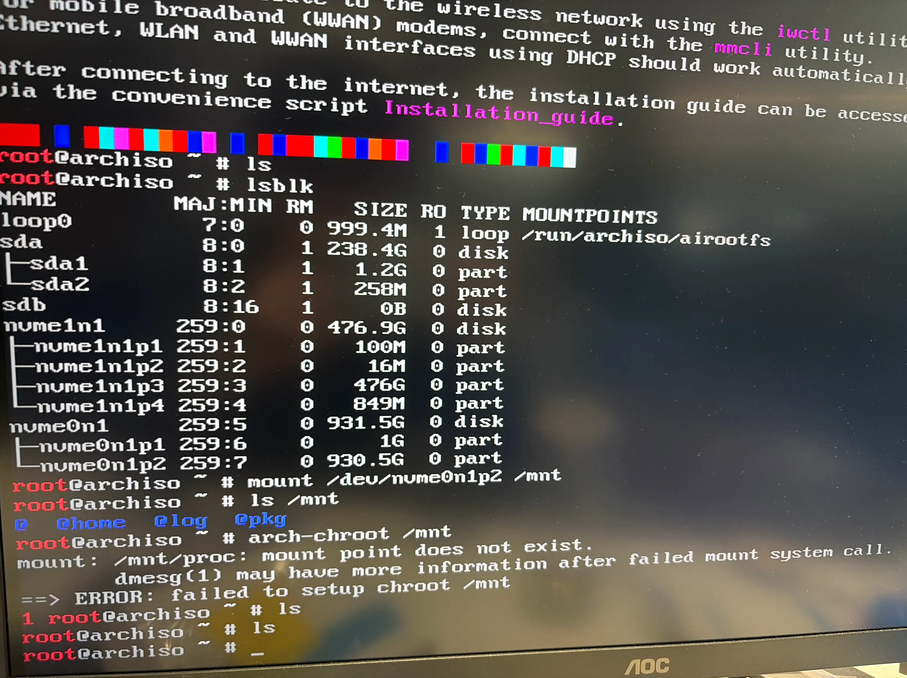
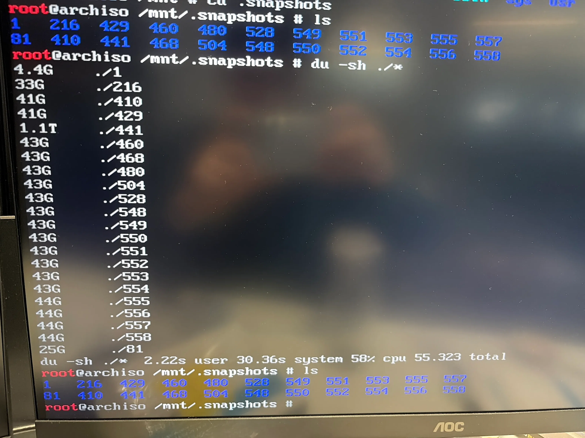
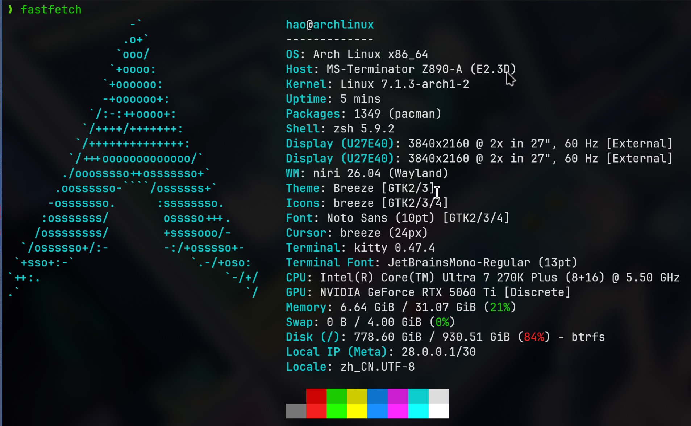

## 背景

2026年7月14日，正在美美做我的Master of AI agents，突然所有服务都挂了，无法打开新的软件，终端里输入命令也很多操作不了。重启之后卡在加载图形化界面，只能在system-boot引导部分修改参数，进入纯TTY模式来操作。

发现是系统磁盘占满了，导致系统卡死，只能尝试救砖，恢复系统。

在system-boot的引导界面，选中archlinux，点击e来修改启动参数，在后面加入：

```bash
systemd.unit=emergency.target
```

最初想着进入TTY里删除掉大文件腾出空间就行，但是情况是文件IO锁死，`rm -rf`的命令根本执行不动。我依次尝试了两种方式

- 切换引导启动windows系统，在里面挂载linux的根文件分区，来删文件
- 插入一个U盘或者SD卡，把大文件转移到里面来腾空间

## 试图通过另外的Windows系统来救砖

对于通过Windows的方式，我尝试了DiskGenius、DiskInternals Linux Reader、Ext2Fsd、Paragon ExtFS for Windows这几个软件。

DiskGenius识别到了archlinux所在磁盘的根文件系统分区和ESP分区，但是只能操作ESP分区而动不了根文件系统分区；Linux Reader这个软件对linux文件系统是只读的，无法操作，一般用于恢复系统，不适合我这种情况；Ext2Fsd是一个很久没有维护的开源软件，打开之后不知道怎么操作，就放弃了了；ExtFS for Windows这个软件，扫描不到分区，也用不了。我于是尝试转移大文件到外部存储设备的方式。



后来了解到，因为我archlinux用的Brtfs系统，如果是ext4，尚可通过windows来操作，但是Brtfs的话目前基本没有操作的方式。

## 试图通过转移文件到外部存储设备



但是这个过程很波折，试了一个U盘和一个SD卡，都是格式化为ext4后用`mount /dev/sda1 /mnt`挂载时，如图，报错显示格式错误无法挂载，也许是设备质量问题。最后一次用了一个高质量的闪迪SD卡，成功挂载上去了。但是在用`mv`转移大文件时，仍然有问题。



AI分析认为是我这个卡是FAT32，不支持Linux的软链接和符号权限，于是只能再通过`mkfs.ext4 /dev/sda1`格式化为EXT4。最终成功挂载了，转移数据也没事，但是速度还是太慢，我无法确定`mv`是正常运行还是同样因为文件IO死锁导致卡死。于是只能放弃。


## 通过archlinux live系统救砖

最终，我选择了一般的archlinux救系统的方式，就是再用U盘做一个启动盘，进入其中的archlinux live系统，挂载已有系统的根文件分区，用`arch-chroot`来救系统或者直接在live系统里删除文件。

为什么最后才考虑到这种方式呢？一是最开始没想到，我还没遇到过archlinux滚挂的情况，二是，我这个电脑用的是N卡，在最初装系统时就因为N卡驱动问题被卡住，进不去U盘的live系统，所以比较抵触这种方式。

我又翻到了当时进不去live系统的解决方案：

在引导界面里，按e来修改启动参数，在最后加上：

```
nomodeset nouveau.modeset=0
```

来禁用N卡。原因是archlinux的iso里没有兼容的N卡驱动，而archliux live系统渲染tty时默认用GPU加速，而我默认显示器还是通过N卡输出的，于是就黑屏了。禁用N卡后才能进入live系统。我用的主板是铭瑄的，其他主板操作方式可能略有不同，但大致思路是这样的。


进入live系统后，通过lsblk可以看到原archlinux系统的根分区是`nvme0n1p3`



但是挂载分区到`/mnt`后，发现里面并不直接是根文件系统的目录，这是因为我archlinux是用的Btrfs文件系统，它内部会分成很多个子卷，例如`/`和`~`就是在不同的子卷里，这样在某些场景下会方便维护。

综上，如果我想操作`/`，就需要挂载`/`对应的子卷，此时里面是没有`~`的，反正如果想操作`~`就需要挂载`~`对应的子卷。

挂载`/`的操作：

```bash
mount -t btrfs -o subvol=@ /dev/nvme0n1p2 /mnt
```

由上图输出所示，`@`对应`/`，`@home`对应`~`

archlinux按照时的常见布局：

```bash
nvme0n1p2
|
└── Btrfs filesystem
      |
      ├── @
      |    ├── bin
      |    ├── usr
      |    ├── var
      |
      ├── @home
      |    └── hao
      |
      └── .snapshots
           |
           ├── 100
           ├── 101
           └── ...
```

挂载后，`/mnt`下面就是除去~的整个rootfs。如果需要`arch-chroot`，则需要通过正确的方式完整挂载rootfs。

因为我只是要删文件，用不到`arch-chroot`。



查看`/.snapshots`，我发现是我brtfs的快照积攒过多，占满了磁盘，于是我就只用删除掉这些快照，系统就能恢复。

我需要通过`brtfs subvolume`来删除每个快照编号下的snapshot文件，例如`/.snapshots/410/snapshot`，在`/.snapshot`下执行

```bash
for i in *; do btrfs subvolume delete "$i/snapshot"; done
```

删除之后重启电脑，archlinux就恢复了，这是恢复后的磁盘占用情况，可以看到删快照腾出了100多GB空间



后面需要优化一下snapper的自动清理机制。
