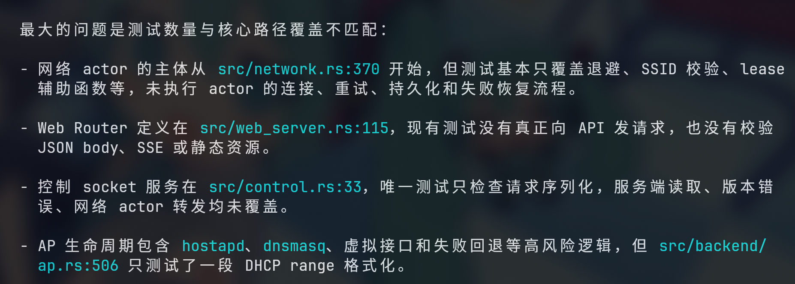

## 背景

最近实习一直在搞一个嵌入式Buildroot设备上的网络服务，通过`wpa`接口来操作网卡的行为，完成网卡的模式切换和配网。这个项目和硬件是强耦合的，很难做到软件逻辑的完全通用：不同网卡对AP+STA并发的支持能力不同、不同内核/SOC的网卡驱动行为不同、有些Target有怪癖（比如需要额外复位），甚至说PCB硬件设计导致的能力不同（比如天线设计）。

这个项目一直催促着我去思考软件架构，尽管绝大多数开发都是通过`Vibe Coding`，但是在开发过程中问题很明显：我想稍微修改一下业务逻辑，Agent就会大规模修改代码，然后再进行部署和测试，以及因为前面所说的硬件支持问题，导致项目的业务逻辑很难做到多平台通用，一用到新的设备就要让Agent进行大范围的代码修改来做适配。

这个过程无疑是非常痛苦的。整个流程有很明显的问题，其中一个就是标题所说的单测和CI覆盖率不行。

Rust和Cargo提供了很方便的单元测试和CI流程，在`Vibe Coding`的过程中Agent也尽可能的添加了单元测试，然后在每轮测试部署的时候`cargo test`和`cargo check`一下来试图检验代码质量。但是如果你人工Review一下，就会发现它所谓的单测问题很大，大部分是在做**字符串解析**、**token生成**、**版本号生成**、**web api测试**这种常规的单元测试。

```rust
	#[test]
    fn v2_errors_publish_schema_version() {
        let response = api_error(StatusCode::CONFLICT, "busy", "busy");
        assert_eq!(response.status(), StatusCode::CONFLICT);
    }

    #[test]
    fn captive_portal_paths_remain_available_without_wlan() {
        assert!(is_captive_portal_path("/hotspot-detect.html"));
        assert!(!is_captive_portal_path("/api/v2/overview"));
    }

    #[test]
    fn ssid_validation_rejects_empty_and_oversized_requests() {
        assert_eq!(
            validate_ssid_response("")
                .expect("empty SSID should fail")
                .status(),
            StatusCode::BAD_REQUEST
        );
        assert_eq!(
            validate_ssid_response(&"x".repeat(33))
                .expect("oversized SSID should fail")
                .status(),
            StatusCode::BAD_REQUEST
        );
        assert!(validate_ssid_response("Home").is_none());
    }
```

好一点的，Agent会借助Tokio的单元测试框架来测试Async任务

```rust
#[cfg(test)]
mod tests {
    use super::*;

    #[tokio::test]
    async fn private_writes_force_mode_0600() {
        let dir = std::env::temp_dir().join(format!(
            "wlan0-bootstrap-private-write-test-{}",
            std::process::id()
        ));
        let path = dir.join("state.json");
        let _ = std::fs::remove_dir_all(&dir);
        std::fs::create_dir_all(&dir).unwrap();
        std::fs::write(&path, b"old").unwrap();
        std::fs::set_permissions(&path, Permissions::from_mode(0o666)).unwrap();

        atomic_write_private(&path, b"new").await.unwrap();

        assert_eq!(std::fs::read(&path).unwrap(), b"new");
        assert_eq!(
            std::fs::metadata(&path).unwrap().permissions().mode() & 0o777,
            PRIVATE_FILE_MODE
        );
        std::fs::remove_dir_all(&dir).ok();
    }
}

```

以下是Codex分析后的评价：



**很明显它没有覆盖到核心的业务逻辑，即网络连接认证、网卡模式切换等等**，这个项目开发过程中更需要的是，在修改业务逻辑的时候更方便地验证核心的API能否正常工作。

Agent所作的也是可以理解的，在野蛮生长的`Vibe Coding`项目中，AI就是会倾向于走最简单的一条路，和硬件强相关的就应该在实际硬件上测试。但是我总觉得，我们应该能通过一些架构上的设计，让单测和CI尽可能覆盖核心业务逻辑。

要做的，应该是如何把硬件行为抽象为可模拟的。
